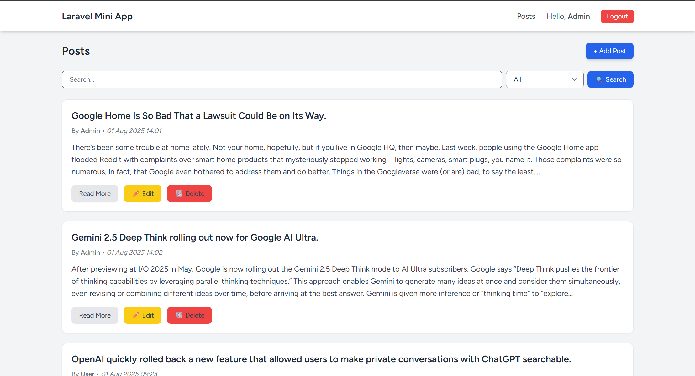
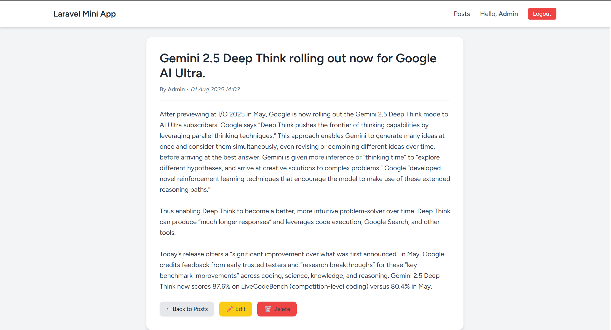

# 📝 Laravel Mini App - Posts Management

A simple **Laravel 10 CRUD (Create, Read, Update, Delete)** application with authentication, posts management, search feature, and elegant UI using **TailwindCSS**.

---

```markdown

## 🚀 Features

✅ User Authentication (Register, Login, Logout)  
✅ CRUD Posts (Create, Edit, Delete) with Ownership Control  
✅ Show Post Detail View with Edit & Delete for Owner  
✅ Search Posts by Title, Author, or Date  
✅ Flash Messages (Success, Error, Warning, Info) with Icons & Auto-hide  
✅ Responsive Design with TailwindCSS  
✅ Laravel Policy for Authorization  
✅ Global Delete Modal (Reusable)  

---

## 🛠 Tech Stack

- **Framework**: Laravel 10  
- **Frontend**: Blade, TailwindCSS  
- **Auth**: Laravel Breeze (or manual auth if configured)  
- **Database**: MySQL  
- **Icons**: Heroicons (SVG)  

---

## 📂 Project Structure

mini_project/
├── app/
│   ├── Http/Controllers/PostController.php
│   ├── Models/Post.php
│   ├── Policies/PostPolicy.php
├── resources/
│   ├── views/
│   │   ├── layouts/app.blade.php
│   │   ├── posts/index.blade.php
│   │   ├── posts/show.blade.php
│   │   ├── posts/create.blade.php
│   │   ├── posts/edit.blade.php
│   │   └── components/alert.blade.php
├── routes/
│   └── web.php
└── README.md

```

## ⚙️ Installation

1. **Clone this repository**

   ```bash
   git clone https://github.com/username/mini_project.git
   cd mini_project
   ```

2. **Install dependencies**

   ```bash
   composer install
   npm install && npm run build
   ```

3. **Setup environment**

   ```bash
   cp .env.example .env
   php artisan key:generate
   ```

4. **Configure database** in `.env`

   ```env
   DB_CONNECTION=mysql
   DB_HOST=127.0.0.1
   DB_PORT=3306
   DB_DATABASE=mini_project
   DB_USERNAME=root
   DB_PASSWORD=
   ```

5. **Run migrations**

   ```bash
   php artisan migrate
   ```

6. **Start the development server**

   ```bash
   php artisan serve
   ```

---

## 🔍 Search Feature

You can search posts by:

* **Title**
* **Author Name**
* **Date (YYYY-MM-DD)**

---

## 🎨 Flash Messages

Flash messages appear on top of the page with icons:

* ✅ Success (green)
* ⚠ Warning (yellow)
* ❌ Error (red)
* ℹ Info (blue)

They automatically hide after 5 seconds.

---

## 🔑 Authentication

* Posts are **private by default** (only the owner can edit/delete).
* Users can **view all posts**, but **edit/delete only their own posts** using `PostPolicy`.

---

## 🖼 Screenshot




---

## 🤝 Contributing

Pull requests are welcome. For major changes, please open an issue first to discuss what you would like to change.

---

## 📜 License

This project is licensed under the MIT License.

```